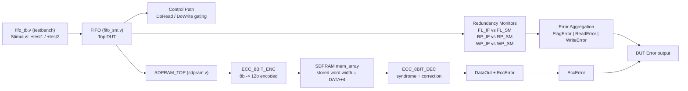
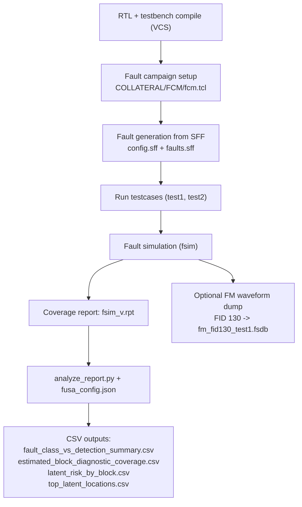
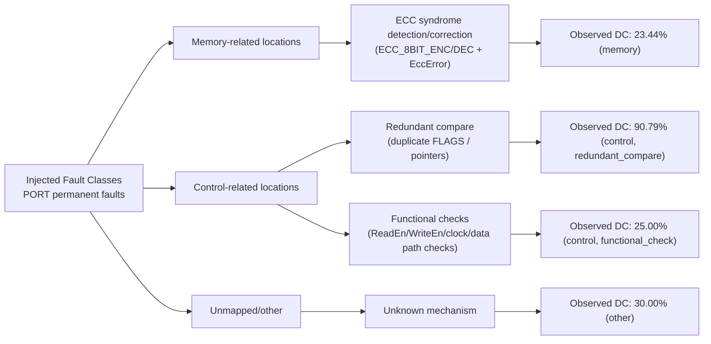

# FIFO Safety Demo: Design + Fault Injection + Safety Mechanisms

## 1) Complete Design Block Diagram (Safety Design Enabled)

## 2) Fault Injection and Simulation Flow

## 3) Safety Mechanisms Used Here (Mapped to Analysis)

## Notes
- Diagram reflects `+define+USE_SAFETY_DESIGN` and `+define+USE_SDPRAM_TOP` from `rtl.f`.
- Detection/coverage labels are based on your current generated CSVs in `fsim_analysis_out/`.
